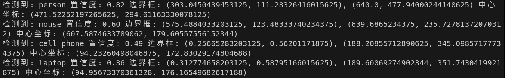
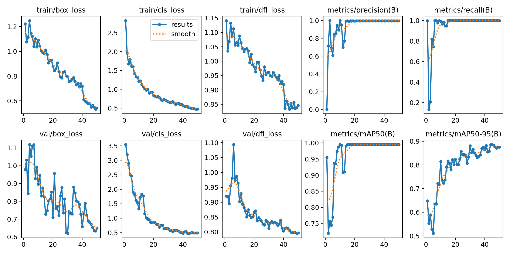

# 视觉感知

## 1. 任务完成

### 图像识别

- 实现实时视频流检测，输出像素框左上角右下角坐标，中心像素坐标，识别物体，置信度。
- 代码 ：

```bash
    python yolo_test2.py   
    ## 其中：model = YOLO("yolov8n.pt")
```

- 视频：

```txt
跑通yolo模型.mp4
```

- 截图：


### 使用门把手数据集进行训练

- 针对门把手数据集完成50轮迭代训练，模型收敛良好。
- 数据集

```text
数据集
dataset/
├── images/
│   ├── train/          # 训练集图片
│   └── val/            # 验证集图片
└── labels/
    ├── train/          # 训练集标签 (yolo格式)
    ├── val/            # 验证集标签 (yolo格式)
    ├── train.cache     # 训练缓存文件
    └── val.cache       # 验证缓存文件
```

- 模型及识别效果

```txt
runs/detect/door_project/
└── my_handler_model2/
    ├── weights/
    │   ├── best.pt     # 性能最好的模型权重
    │   └── last.pt     # 最后一次训练的权重
    ├── results.png     # 训练损失与精度曲线图
    ├── results.csv     # 训练数据表格
    ├── confusion_matrix.png  # 混淆矩阵
    ├── args.yaml       # 训练参数配置
    └── val_batch0_pred.jpg   # 验证集预测效果图
```

- 源代码及视频

```txt
split_data.py 用于分离数据YOLO_Data->dataset
train.py
训练后的模型.mp4
```

```bash
    python yolo_test2.py   
    ## 其中：model = YOLO('best.pt')
```

- 模型识别效果


1. train/box_loss (训练集边界框损失)
该图展示了训练过程中模型预测框与真实框之间的差异变化。可以看到，曲线从约1.2下降到0.6以下。
2. val/box_loss (验证集边界框损失) 曲线在前期波动较大（因为模型在尝试适应未见过的数据），整体趋势向下，最终收敛在0.65左右。这说明输出像素坐标 $(x, y)$ 是可靠的。
3. train/cls_loss (训练集分类损失)
分类损失反映了模型判断“这是不是门把手”的准确度。曲线呈现下降趋势，最终收敛至0.5附近。这表明模型在训练集上几乎可以100%正确区分门把手与背景。
4. val/cls_loss (验证集分类损失)
验证集分类损失与训练集类似，最终收敛至0.5左右。由于验证集损失与训练集损失高度同步且没有出现反弹，证明模型具有强泛化能力，没有产生过拟合现象。
5. train/dfl_loss (训练集分布焦点损失)
DFL损失用于微调边界框的边缘精度。注意到在第40轮之后曲线有明显下降，这是因为训练后期通常会关闭某些数据增强策略进行精修。最终数值降至约0.85，说明模型对边缘细节的刻画变得更加细腻。
6. val/dfl_loss (验证集分布焦点损失)
验证集的边缘微调损失在40轮后也同步下降，最终稳定在0.8附近。这确保在测试环境中，模型给出的边界框边缘紧贴门把手轮廓。
7. metrics/precision(B) (精确率)
精确率代表模型预测的所有目标中，有多少是真的门把手。曲线在第15轮左右就到了0.995（100%附近）并保持稳定。可以看出模型极少出现识别门把手错误的情况。
8. metrics/recall(B) (召回率)
召回率代表所有真实的门把手中，模型能找回多少。同样地，该曲线在15轮后也稳定在1.0左右。体现模型对视频流中出现的门把手基本都能捕捉到。
9. metrics/mAP50(B) (平均精度均值IoU 0.5)
曲线在短时间内就至0.99以上并形成一条直线。模型识别精准度高。
10. metrics/mAP50-95(B) (严苛模式下的平均精度)
这是在不同重叠度阈值（0.5到0.95）下的综合评分。它从0.5 至0.88。体现模型坐标定位精准性。

### 卡尔曼滤波

- 在YOLO基础上加入运动状态估计，增强了在目标遮挡时的预测能力。防止yolo暂时失去跟踪或者摄像头暂时被遮挡的情况。

```txt
    yolo_test2_filter.py  
    卡尔曼滤波.mp4
```

## 2. 核心文件说明

| 文件名 | 类型 | 说明 |
| :--- | :--- | :--- |
| `train.py` | 训练脚本 | 使用 `yolov8n.pt` 并在 CPU 环境下完成 50 轮训练。 |
| `yolo_test2.py` | 感知脚本 | 实时输出**识别到的物体/门把手**中心坐标(x, y)并进行视觉标注。 |
| `yolo_test2_filter.py` | 追踪脚本 | 结合 `filterpy` 实现卡尔曼滤波，预测丢失目标的运动轨迹。 |
| `best.pt` | 权重文件 | 训练过程中性能最优的模型权重文件。 |
| `yolov8n.pt` | 初始权重文件 | 最初跑通的yolo模型。 |

## 3. 环境依赖

- Python 3.8+
- ultralytics (YOLOv8)
- filterpy
- opencv-python
